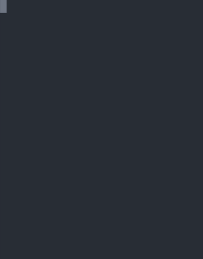

Pure Ruby implementation of the Snake game that you can play on your production servers while pretending to work.

<p align="center">
  
</p>

Instead of hunting for a rabbit, we hunt for a Ruby gem.

You control the snake with following keys:

- `Arrow up` - snake goes up
- `Arrow left` - snake goes left
- `Arrow right` - snake goes right
- `Arrow down` - snake goes down
- `Any other key` - you've lost

## Source code

```ruby
R="\e[31m\u25C6\e[0m\e[32m ";U="\n\r";B="\u25FC ";Y="\u25CB ";$t=ARGV.first
.to_i.yield_self{|s|(s>12)?s:12};$r=0...$t+2;$i=[];$c=[];$k=[0,1];$x=->{$l=
[rand(1..$t),rand(1..$t)]while$l.nil?||$i[$l[0]][$l[1]]==B;$i[$l.first][$l[
1]]=R};require'io/console';$p=0;$s=0;$r.each{|x|$i.push$r.each_with_object(
[]){|y,r|r.push(x.between?(1,$t)&&y.between?(1,$t)?(Y):(B))}};Thread.new{$x
.();3.times{|i|$i[$t][1+i]=B;$c[i]=[$t,1+i]};loop{r=$c[$c.count-1][0];c=$c[
$c.size-1][1];(exit)if$i[r+$k[0]][c+$k[1]]==B;$i[r+$k.first][c+$k[1]]=B;$c.
push([r+$k[0],c+$k[1]]);(r==$l[0]&&c==$l[1])?($x.();$p+=(100-$s*10).itself.
yield_self{|a|a<1?1:(a)}+$u;$s=0):($i[$c[0][0]][$c[0][1]]=Y;$c.shift;$s+=1)
$u=($c.size-3)/10.0;system'clear';puts"\e[32m";$i.map(&lambda{|r|r.map(&$s.
method(:print));print(U)});print"\e[0mPoints:#{$p.to_i}#{U.to_s}Level:#{$u.
floor}#{U}Gems:#{($u*10).round(0)}";print(U);sleep(0.3-$u.floor.to_f/50.0)}
};loop{$stdin.getch;k=$stdin.read_nonblock(2)rescue(nil);$k=(k=='[A')?([-1,
0]):((k=='[B')?([1,0]):((k=='[C')?([0,1]):((k.eql?'[D')?([0,-1]):(exit))))}
```

### Playing the game 

```
gem install snaker
snaker
```

or save the above code into a `game.rb` file and run it as followed:

```
ruby snaker.rb
# Or provide a board size as the first argument
ruby snaker.rb 20
```

## Features

- Snake runs in a separate thread to the one that controls him.
- Snake is controlled using the non-blocking keyboard listener.
- The game includes levels counter.
- With each level gained, snake gets a bit faster.
- The game includes pointing engine that grants points for getting to a gem with as least moves as possible with taking the current level into consideration (more points on higher levels).
- Constant names definitions and global variables make up "RUBY trick".
- Each line consists exactly 75 characters.
- The game board size can be dynamically adjusted.
- Game detects if you want to move backwards and will consider that a loss.
- The game takes advantage of the 2.5.0 ```#yield_self``` for validating the minimal board size when board size provided is less than 12.
- The game ensures that a new gem (after eating one) does not appear on the snake.
- Anonymous lambda is being used to render the game board with all the details.

## Limitation

- Once we collect enough gems, snake won't fit and will die.
- With a board bigger than 40 it may not fit into the terminal (depending on the terminal settings)
